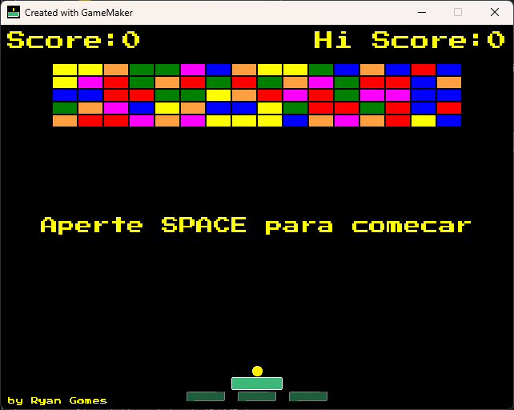
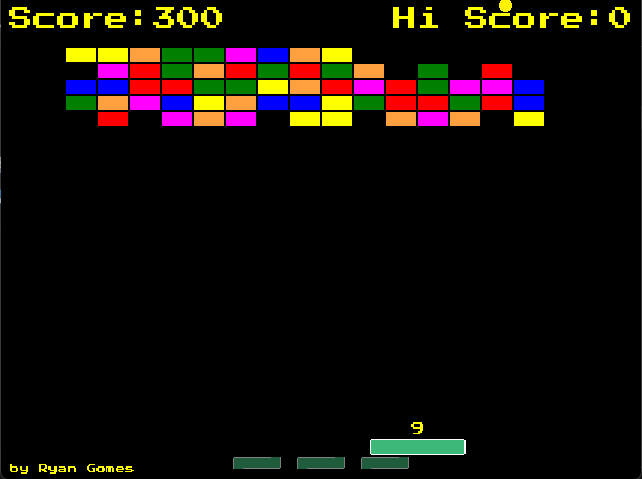

# 🧱 Breakout - Jogo Clássico Recriado

## 🌐 Select Language / Selecione o Idioma
[🇺🇸 English](#-Breakout---Classic-Arcade-Game) | [🇧🇷 Português](#-Breakout---Jogo-Clássico-Recriado)

---

#  Breakout - Classic Arcade Game

## 📖 Summary
**Breakout** is a recreation of the classic arcade game, where your goal is to destroy all the bricks by bouncing the ball with your paddle.

---

## 🎮 Controls
- **Move Paddle**: Use the **arrow keys** (⬅️ ➡️) to move.
- **Start Ball**: Press **SPACE** for the ball to leave.
- **Objective**: Break all the blocks without letting the ball fall.
- **Game Over**: Don't lose the three lives.

---

## 🚀 Features
- ✅ Bounce application that changes the direction of the ball depending on the angle.
- ✅ Powerups appear randomly when destroying a block.
- ✅ Score System.
- ✅ Sound effects for collisions and block destruction.

---

## 🖥️ Technologies
- **GameMaker Studio 2**
- **GML (GameMaker Language)**

---

## 📂 How to Play
1. Download the repository:
2. Open the project in **GameMaker Studio 2**.
3. Compile and play!

---

## 📸 Preview

---

## 👨‍💻 Author
Developed by **Ryan Gomes**.

---

## 📄 License
This project is licensed under **MIT**.

---

# 🇧🇷 Breakout - Jogo Clássico Recriado

## 📖 Resumo
**Breakout** é uma recriação do clássico jogo de arcade, onde o objetivo é destruir todos os blocos controlando uma plataforma que rebate a bola.

---

## 🎮 Controles
- **Mover Plataforma**: Use as **setas direcionais** (⬅️ ➡️) para mover.
- **Iniciar a Bola**: Aperte **SPACE** para a bola sair.
- **Objetivo**: Quebre todos os blocos sem deixar a bola cair.
- **Derrota**: Não perca as três vidas.

---

## 🚀 Features / Mecânicas
- ✅ Aplicação de Bounce que muda a direção da bola dependendo do ângulo.
- ✅ Poderes aparecem aleatoriamente ao destruir um bloco.
- ✅ Sistema de pontuação.
- ✅ Sons para colisões e destruição dos blocos.

---

## 🖥️ Tecnologias Utilizadas
- **GameMaker Studio 2**
- Linguagem **GML (GameMaker Language)**

---

## 📂 Como Jogar
1. Baixe a EXE ou o arquivo .zip:

---

## 📸 Imagens

---

## 👨‍💻 Autor
Desenvolvido por **Ryan Gomes**.

---

## 📄 Licença
Este projeto está sob a licença **MIT**.
