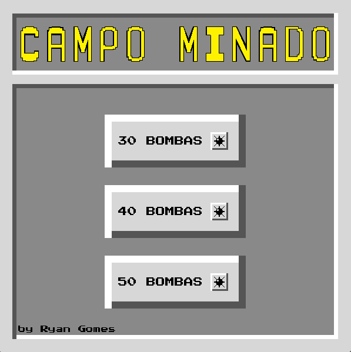
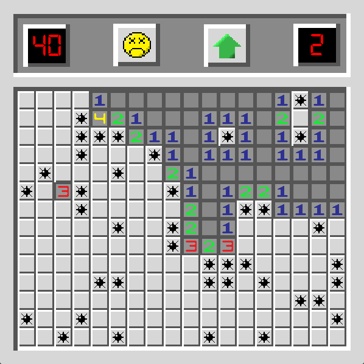

# 💣 Campo Minado - Jogo Clássico Recriado

## 🌐 Select Language / Selecione o Idioma
[🇺🇸 English](#eng---minesweeper---classic-pc-game) | [🇧🇷 Português](#port---campo-minado---jogo-clássico-recriado)

---

# ENG - Minesweeper - Classic PC Game

## 📖 Summary
**Breakout** is a faithful recreation of the classic logic puzzle game. The goal is to clear a rectangular board containing hidden "mines" without detonating any of them, with help from clues about the number of neighboring mines in each field.

---

## 🎮 Controls
- **Left Click**: Open a square.
- **Right Click**: Place/Remove a flag (🚩) on a suspected mine.
- **Smile Icon**: Restart the game.
- **House Icon**: Back to the menu.
- **Objective**: Flag all mines and open all safe squares.

---

## 🚀 Features
- ✅ Dynamic Difficulty: Choose between 30, 40, or 50 mines.
- ✅ Logic System: Numbers correctly indicate adjacent mines.
- ✅ Classic UI: Includes mine counter and game status icons (Smiley/Dead face).
- ✅ Sound effects for collisions and block destruction and soundtrack on menu and gameover.

---

## 🖥️ Technologies
- **GameMaker Studio 2**
- **GML (GameMaker Language)**

---

## 📂 How to Play
- Download the EXE folder or the .zip file:

---

## 📸 Preview

---

## 👨‍💻 Author
Developed by **Ryan Gomes**.

---

# English

## 📄 License
This project is licensed under **MIT**.

---

# PORT - Campo Minado - Jogo Clássico Recriado

## 📖 Resumo
**Campo Minado** é uma recriação fiel do clássico jogo de lógica. O objetivo é limpar um tabuleiro retangular contendo "minas" escondidas sem detonar nenhuma delas, com a ajuda de pistas sobre o número de minas vizinhas em cada campo.

---

## 🎮 Controles
- **Botão Esquerdo**: Abre um quadrado.
- **Botão Direito**: Colocar/Remover uma bandeira (🚩) em uma mina suspeita.
- **Icone Rosto**: Reinicia o jogo.
- **Icone Casa**: Volta para a tela inicial.
- **Objetivo**: Marcar todas as minas e abrir todos os quadrados seguros.

---

## 🚀 Features / Mecânicas
- ✅ Dificuldade Dinâmica: Escolha entre 30, 40 ou 50 bombas.
- ✅ Sistema de Lógica: Números indicam corretamente as bombas adjacentes.
- ✅ Interface Clássica: Inclui contador de bombas e ícones de status (Rosto feliz/morto).
- ✅ Sons para colisões e destruição dos blocos e trilha sonora no menu e fim de jogo.

---

## 🖥️ Tecnologias Utilizadas
- **GameMaker Studio 2**
- Linguagem **GML (GameMaker Language)**

---

## 📂 Como Jogar
- Baixe a pasta EXE ou o arquivo .zip:

---

## 📸 Imagens

---

## 👨‍💻 Autor
Desenvolvido por **Ryan Gomes**.

---

## 📄 Licença
Este projeto está sob a licença **MIT**.
