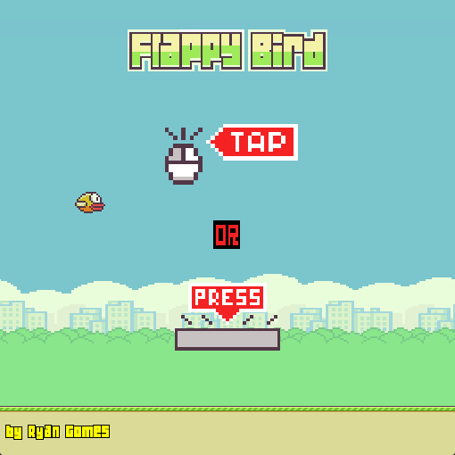
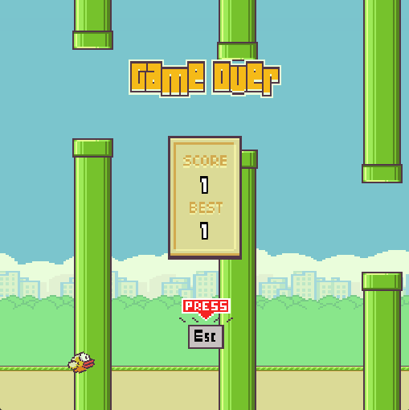

# 🐦 Flappy Bird - Jogo Clássico Recriado

## 🌐 Select Language / Selecione o Idioma
[🇺🇸 English](#eng---flappy-bird---classic-mobile-game) | [🇧🇷 Português](#port---flappy-bird---jogo-clássico-recriado)

---

# ENG - Flappy Bird - Classic Mobile Game

## 📖 Summary
**Flappy Bird** is a recreation of the famous mobile game where you control a bird trying to fly between columns of green pipes without hitting them.

---

## 🎮 Controls
- **Left Click / Tap**: Make the bird flap its wings and gain height.
- **Space Bar**: Also used to jump/flap.
- **Esc Key**: Back to the menu or restart after Game Over.
- **Objective**: Pass through as many pipes as possible to get the highest score.

---

## 🚀 Features
- ✅ **Physics System**: Gravity and jumping mechanics tuned for the classic feel.
- ✅ **Score System**: Real-time score and "Best" score save system.
- ✅ **Procedural Generation**: Pipes appear at random heights infinitely.
- ✅ **Parallax Background**: Scrolling city scenery and animated ground.

---

## 🖥️ Technologies
- **GameMaker Studio 2**
- **GML (GameMaker Language)**

---

## 📂 How to Play
- Download the EXE folder or the .zip file:

---

## 📸 Preview

---

## 👨‍💻 Author
Developed by **Ryan Gomes**.

---

## 📄 License
This project is licensed under **MIT**.

---

# PORT - Flappy Bird - Jogo Clássico Recriado

## 📖 Resumo
**Flappy Bird** é uma recriação do famoso jogo mobile onde você controla um pássaro que deve voar entre colunas de canos verdes sem colidir com eles.

---

## 🎮 Controles
- **Clique Esquerdo / Tap**: Faz o pássaro bater as asas e ganhar altura.
- **Barra de Espaço**: Também utilizada para pular.
- **Tecla Esc**: Volta para o menu ou reinicia após o Game Over.
- **Objetivo**: Passar pelo maior número de canos possível para alcançar a pontuação máxima.

---

## 🚀 Features / Mecânicas
- ✅ **Sistema de Física**: Mecânica de gravidade e pulo ajustada ao estilo clássico.
- ✅ **Sistema de Pontuação**: Pontuação em tempo real e sistema de "Best Score" (recorde).
- ✅ **Geração Procedural**: Canos surgem em alturas aleatórias infinitamente.
- ✅ **Fundo Parallax**: Cenário da cidade com rolagem e chão animado.

---

## 🖥️ Tecnologias Utilizadas
- **GameMaker Studio 2**
- Linguagem **GML (GameMaker Language)**

---

## 📂 Como Jogar
- Baixe a pasta EXE ou o arquivo .zip:

---

## 📸 Imagens

---

## 👨‍💻 Autor
Desenvolvido por **Ryan Gomes**.

---

## 📄 Licença
Este projeto está sob a licença **MIT**.
